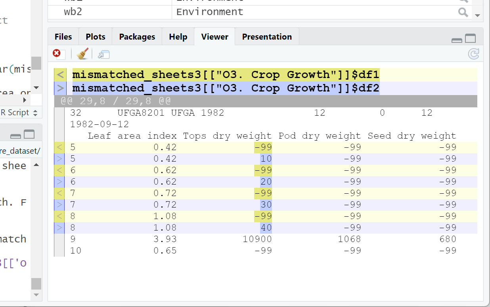

**Comparing Florida BMP Datasets in Template Format**

**Script:** FL_Crop_BMP_dataset_compare

**Date:** Feb. 17, 2025

**Introduction**

On occasion, users may need to compare two workbooks to resolve issues
relating to versions or updates, especially when dataset preparation is
shared among researchers. The FL_Crop_BMP_dataset_compare script allows
users to compare pairs of workbooks and identify differences in numbers
of sheets, sheet names, and data contained within the sheets. The main
differences are reported to the RStudio console and are also written to
the text file “Excel compare.log”.

If differences are found in data contained in pairs of sheets, these may
be viewed in a side-by-side comparison in the RStudio Viewer. An example
is given in Figure 1 for differences in data between two versions of
sheet ‘O3. Crop Growth’ of an example pair of datasets.

*Figure 1. Output of the diffObj() function as viewed in the RStudio
viewer. Differences in data are highlighted in different colors. Only
the portions of the data frames that differ are displayed.*

**Procedure for Comparing Workbooks**

The full procedure for comparing workbooks is outlined in the steps
below. We assume that the user is familiar with basic operation of the R
language, use of RStudio, and organization of their datasets.

1. Download the script ‘FL_Crop_BMP_dataset_compare.R’ to whatever
   folder you prefer.

2. Open the script in RStudio.

3. If not done previously, install the following packages from Tools
   -\> Install packages …
   
   1. diffobj
   
   2. logr
   
   3. openxlsx2

4. Edit the file path names for the two files you wish to compare. For
   example:

> file_path1 \<- file.path("FDACS_UFGA8201_peanut.94.xlsx")
> 
> file_path2 \<- file.path("FDACS_UFGA8201_peanut.94_new.xlsx")
> 
> The function file.path() can receive multiple arguments, allowing you
> to specify complex paths if needed.

6. Run the script from RStudio by entering ‘alt-ctrl-r’ or navigating
   through the menu bar to Code -\> Run Region -\> Run All.

7. The script should run, outputting the results of the comparisons to
   the console as it goes through tests of increasing stringency. A log file, "Excel compare.log" is also generated.

8. If there are differences in the numbers of sheets, sheet names, or
   dimensions of data on sheets (based on all rows and columns), the
   script will halt processing with a warning message. The log file
   will also contain a report.

9. If differences in the content of individual sheets are found, these
   will be reported according to the three areas of data on each sheet:
   
   - Row 1 for instructions.
   
   - Rows 2 and 3 for suggested terms and units.
   
   - Row 4 and beyond for main data.

10. To obtain detailed information on where the differences occur, the
    user has to enter a command in the console similar to:

> diffObj(mismatched_sheets3\[\['O3. Crop Growth'\]\]\$df1,
> mismatched_sheets3\[\['O3. Crop Growth'\]\]\$df2)

The results, such as in Fig. 1, are displayed in the Viewer window of
RStudio. You may resize your windows if there are multiple differences.

This completes the process for comparing similar datasets.

Instructions on displaying the file comparison are provided at the end
of the RStudio console output and in the log file, but since the process
is a bit complicated, we summarize the process here:

1. From the console, identify the area of sheet where differences were
   found and the list of sheets having differences. For example:

> Differences were found for the area: 3 = Row 4 and beyond for main
> data in the following sheets:
> 
> O3. Crop Growth
> 
> S1. Soil Metadata
> 
> S2. Soil Layer Properties

2. From the console, copy the example code:

> diffObj(mismatched_sheets1\[\['Z2. Dictionary Observations'\]\]\$df1,
> mismatched_sheets1\[\['Z2. Dictionary Observations'\]\]\$df2)

3. Paste the single line of code after the command prompt in the
   console (“\>”).

4. Edit the number 1, 2 or 3 appended to “sheets” to match
   the number that appears in the message on differences found (e.g. “…
   for the area: 3 =).

5. Edit the sheet name by copying from the list where differences were
   found, remembering to conserve the single quotes used to delimit the
   sheet name and to edit in both name locations using the **same**
   name.

6. Once the edits are completed, run the script by hitting Enter.

7. The diffObj function should display the side-by-side comparisons of
   the selected sheet, showing only sections where differences were
   found. If there are no error messages in the console area, but you don’t see
   the expected comparison, make sure that the Viewer tab is selected
   (type Ctrl-9).

Remember that you can resize the Viewer window to see more rows or
columns of data. The diffObs function will display multiple blocks of
data (“hunks”) if neeed. See the diffObs documentation:
<https://cran.r-project.org/web/packages/diffobj/vignettes/diffobj.html#interpreting-diffs>
for more information.

**Troubleshooting**

The most likely problem will be failure to find one or both of the
datasets, which will cause the script to abort with the message:

Error in wb_load(file_path1) : File does not exist.\n"

If you are using diffObj(), be sure to edit in the integer (1, 2 or 3)
after “sheets” in **both** positions and that the sheet name is given
correctly in **both** positions.

In developing the script, we encountered a problem with a sheet
that contained empty cells. We believe this problem has been resolved,
but if an error occurs when the script executes wb_to_df(), please try
to isolate the problem and contact us.
